<h1>TUNNING OF CNN WITH EC2</h1>

<h2>Description</h2>
This project aims to build, train, and optimize a Convolutional Neural Network (CNN) for image classification tasks using AWS EC2. The goal is to leverage AWS cloud infrastructure to handle computationally intensive tasks, ensuring scalability, efficiency, and cost optimization.

The project involves creating a robust pipeline to preprocess image data, build a CNN architecture, and tune hyperparameters to achieve high classification accuracy. By deploying the model on GPU-enabled EC2 instances, the training process will be accelerated, making it suitable for handling large datasets.

Additionally, the project will explore performance optimization techniques such as learning rate scheduling, regularization, and efficient resource utilization on EC2. The trained model will be evaluated on test data to ensure generalization and accuracy, and the results will be visualized for insights..

<h2>Objectives:</h2>
- <b>Set up an EC2 instance with appropriate machine learning frameworks (e.g., TensorFlow, PyTorch).</b><br>
- <b>Preprocess a large dataset of images for CNN training and evaluation.</b><br>
- <b>Design and implement a CNN architecture tailored to the dataset.</b><br>
- <b>Train the model on EC2 using GPU acceleration for faster computation.</b><br>
- <b>Optimize the model using hyperparameter tuning techniques.</b><br>
- <b>Evaluate model performance and visualize results.</b><br>
- <b>Explore cost-efficient strategies for cloud computing resources.</b>
<br />


<h2>Expected Outcome:</h2>

- <b>A trained CNN model with high accuracy for image classification.</b> 
- <b>Detailed insights into the impact of hyperparameter tuning and cloud optimization on model performance.</b>
- <b>Documentation of cost-efficient resource utilization on AWS EC2.</b>
  
<h2>Tech stack:</h2>

- <b>AWS CONSOLE.</b> 
- <b>AWS EC2: For scalable compute resources.</b>
- <b>TensorFlow/Keras or PyTorch: For building and training the CNN.</b>
- <b>JupyterNotebook(Python): For coding and model implementation.</b>

<h2>Program walk-through:</h2>

<p align="center">
Navigate to EC2 and select an AMI that sweetable for Tensorflow : <br/>
 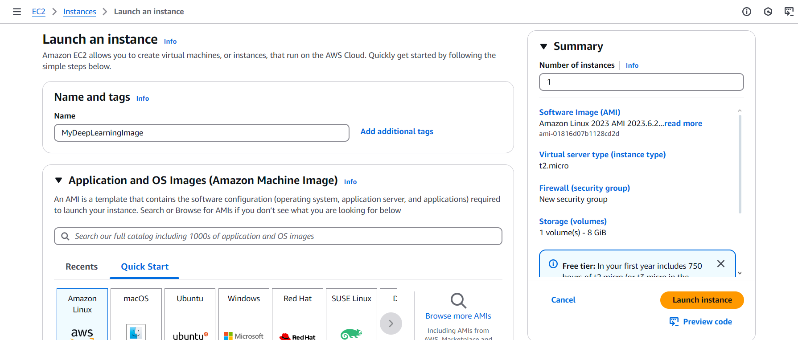
<br />
 
<br />
Select an instance that is sweetable for your AMI to reduce cost:  <br/>
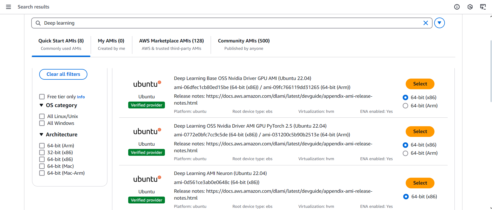
<br />

<br />
Creat SSH connection between your instance as a turnel through the web you can use  <br/>
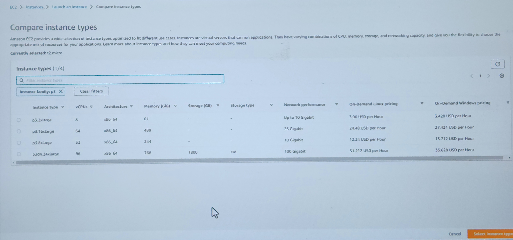
<br />

<br />
Configure the connection using Putty:  <br/>
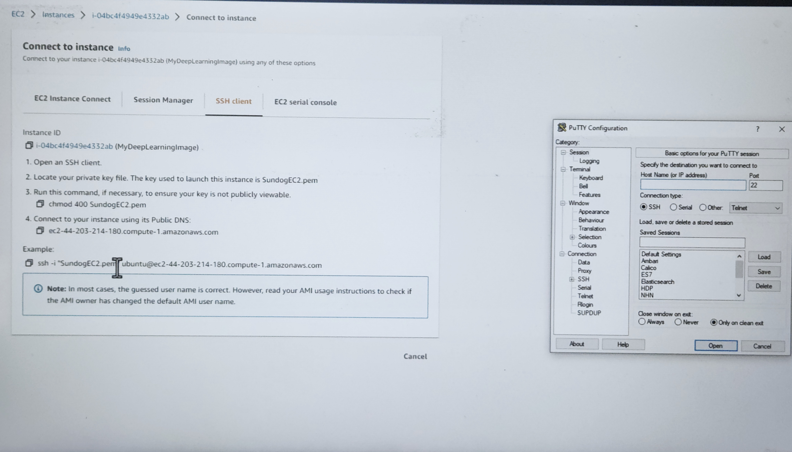
<br />
Open the putty turnel writing "Jupiter Notebook" to have connection through your EC2 instance:  <br/>
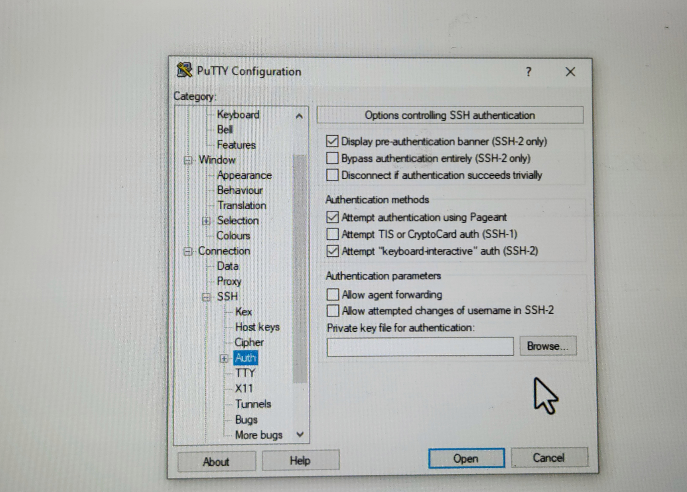
<br />
Upload your CNN-Tunning Notebook into Jupyter.:  <br/>

<br />
Upload raw dataset into jupyter notebook using "shift Enter" or Run button:  <br/>

<br />
Reshape the image data to a 2D Array to a floating point format:  <br/>
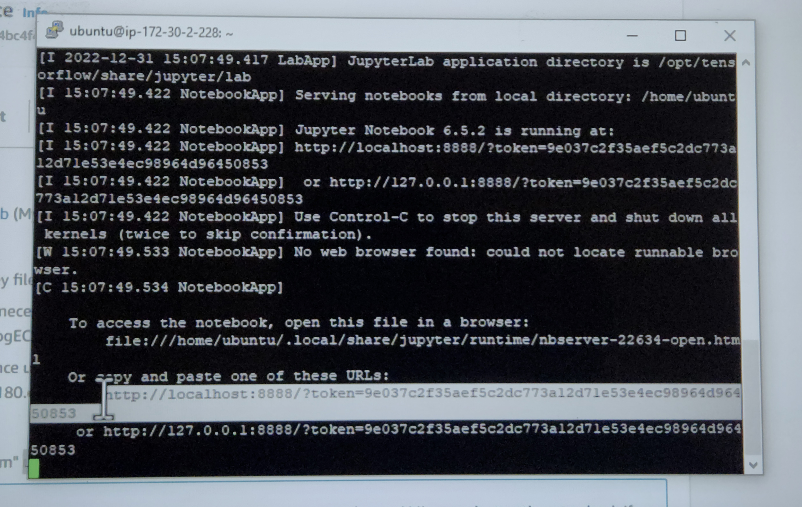
<br />
Label Data preparation:labels are one-hot encoded converting interger class labels:  <br/>
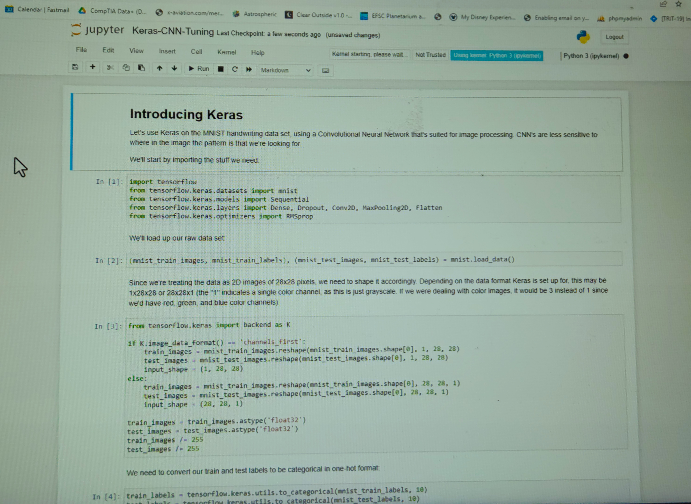
<br />
We visualize sample image to confirm prper formattingt and scaling ensuring that data is prepared correctly for input into CNN:  <br/>
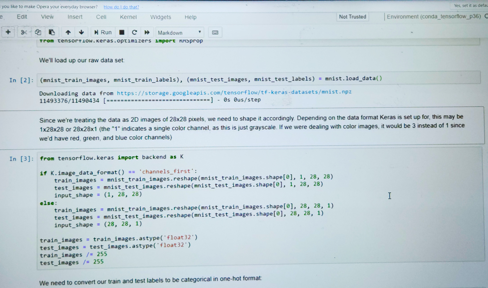
<br />
structure of our Neural Network to be:  <br/>
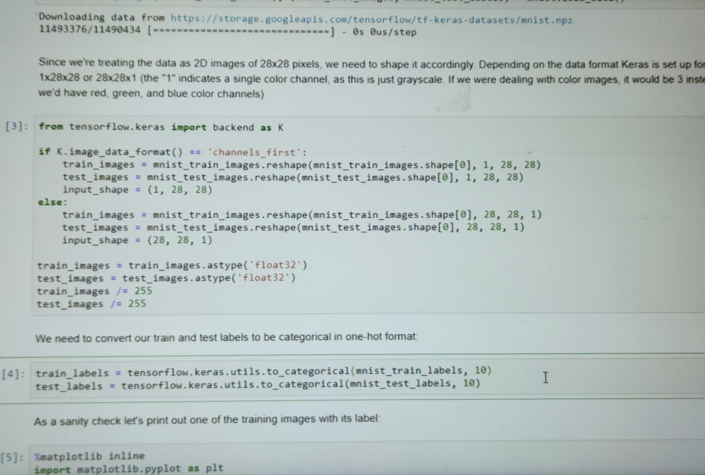
<br />
To compile the model, we need a loss Function and an optimizer for this multi class classification task,we use categorica; cross_entering as the loss function:  <br/>
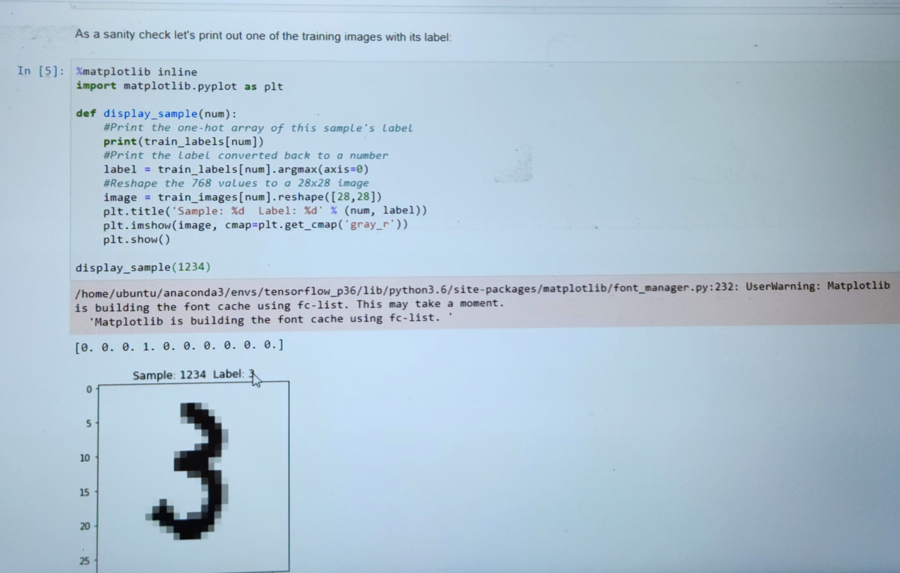
<br />
Train your Model:  <br/>
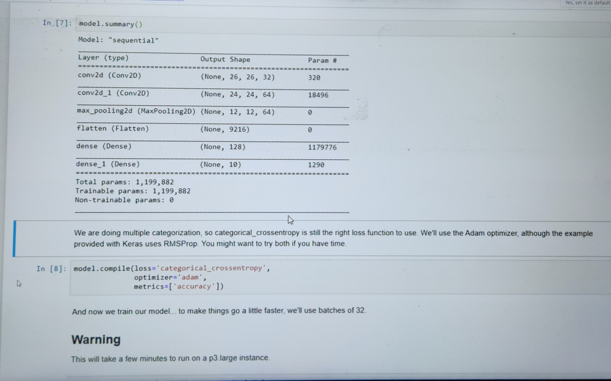
<br />
From the Model result of the trained data the accuracy of the trained data is increased compare to that of the test data that a sign of overfitting:  <br/>
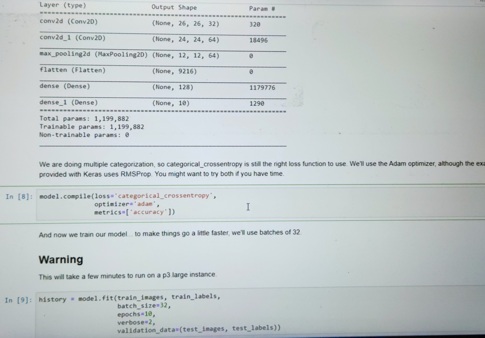
<br />
To prevent overfitting we going to use a tecdhnique known as Regulirizaton,Dropout :  <br/>
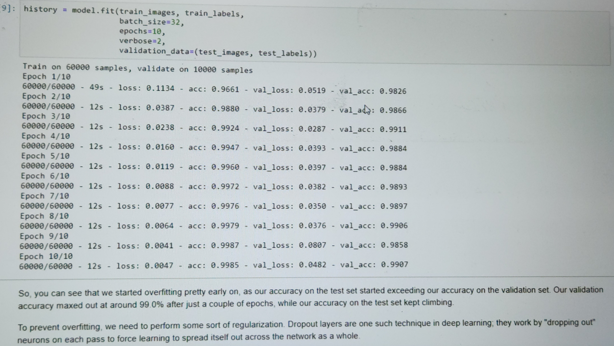
<br />
Test the accuracy of your Data:  <br/>
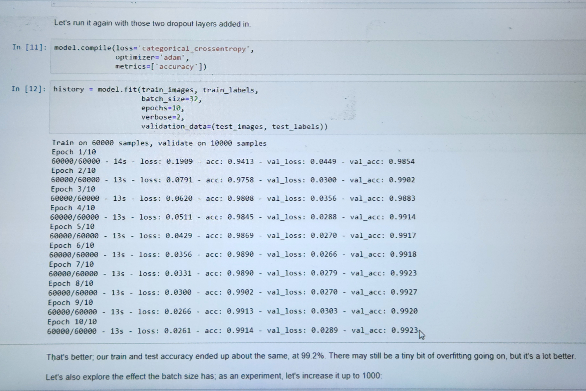
</p>

<!--
 ```diff
- text in red
+ text in green
! text in orange
# text in gray
@@ text in purple (and bold)@@
```
--!>
